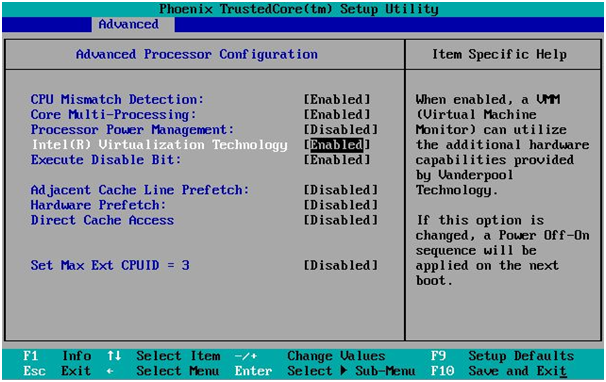

## FAQ/Troubleshooting ##
{:.no_toc}

* TOC
{:toc}

### What science is being done with Cosmology@Home? ###
{:#science}
For an introduction to the science we do at Cosmology@Home, see [this](http://cosmicmar.com/posts/tbd) multi-part blog post. 

To summarize, we run the [CAMB](http://camb.info) code, the results from which are used to train the [PICO](https://sites.google.com/a/ucdavis.edu/pico/) code, which in turn is used by various groups in the field to analyze cosmological datasets. Perhaps most notably, PICO is used extensively in the analysis of [Planck](http://www.esa.int/Our_Activities/Space_Science/Planck) data (e.g. this [paper](http://xxx.lanl.gov/abs/1507.02704)). The papers describing PICO itself can be found [here](http://arxiv.org/abs/astro-ph/0606709) and [here](http://arxiv.org/abs/0712.0194). 

### What if my computer doesn't meet requirements? ### 
{:#camb-legacy}
Cosmology@Home runs multiple "apps." The [requirements list](join.php#requirements) is for the default app (named *camb_boinc2docker*), but if your computer does not meet them, there is an older app available (named *camb_legacy*) which runs on just Windows and Linux but supports 32-bit processors and does not need Virtualbox or VT-x/AMD-v. At this point we only use the results from *camb_legacy* for testing the [PICO](#science) algorithm and not for comparing with data since the app is fairly old. However, the results do serve a limited purpose and allow Cosmology@Home users who do not meet the above requirements to continue to contribute, thus we continue to provide it. We encourage users who can run *camb_boinc2docker* to do so, however. 

### What is VT-x or AMD-v and why do I need it? ###
{:#vtx}
This is a feature of modern processors (Intel calls theirs "VT-x" and AMD calls theirs "AMD-v") which Virtualbox needs to be able to run 64-bit virtual machines like the ones used by Cosmology@Home.

One way to check if your processor supports VT-x/AMD-v is to look up your processor specifications online. It may be easier however to simply try and run Cosmology@Home. If you receive any *camb_boinc2docker* jobs it means BOINC has detected that your processor has support. 

However, it may still be that while your processor supports VT-x/AMD-v, these features are turned off in your BIOS. If your *camb_boinc2docker* jobs download but hang for ~5min then die, this may be the case. To enable it, you need to reboot your computer, enter your BIOS, find this option and enable it. Here is an example of what it might look like (although this will vary with BIOS version, it will likely say something about virtualization): 

### How can I limit the number of CPUs used? ###

*camb_boinc2docker* is multi-threaded and will use up all available cores which BOINC allows it to. For example, if in the BOINC computing preferences you have set "Use at most 50% CPU time" and you have a 4-core processor, the job will use two of them. 

If for whatever reason you wish to limit the number of cores used without changing the global BOINC CPU usage, you can do so by placing the following text in a file called `app_config.xml` in the Cosmology@Home project folder  (thanks to [Crystal Pellet](http://www.cosmologyathome.org/forum_thread.php?id=7227&nowrap=true#20300)):

~~~xml
    <app_config>
        <project_max_concurrent>1</project_max_concurrent>
        <app>
            <name>camb_boinc2docker</name>
            <max_concurrent>1</max_concurrent>
        </app>
        <app_version>
            <app_name>camb_boinc2docker</app_name>
            <plan_class>vbox64_mt</plan_class>
            <avg_ncpus>7</avg_ncpus>
            <max_ncpus>7</max_ncpus>
        </app_version>
    </app_config>
~~~

### How does the *camb_boinc2docker* app work? ###
* These jobs run inside of a [Virtualbox](https://en.wikipedia.org/wiki/VirtualBox) virtual machine. 
* Within the virtual machine, the code itself is packaged within a so called "[Docker](https://www.docker.com/whatisdocker) container". 
* The first thing the jobs do is download the necessary Docker container from the Docker servers. During this download, you will see the job progress frozen at 0.100%. Once the download is complete, the progress bar should continue normally and your CPU usage will jump up as the computation begins. 
* After you run your first *camb_boinc2docker* job, the Docker container which was downloaded will be saved to your computer, so it will not need to be downloaded again unless you remove or reset the Cosmology@Home project. 
* When we update the app in the future, parts of the Docker container will be redownloaded, however, Docker is smart about only downloading the parts which have actually changed  (that's why we use it!). 

### Why is there no 32-bit support? ###
Docker only supports 64-bit processors. For those with 32-bit computers wishing to contribute to Cosmology@Home, you might still be able to run the [legacy application](#camb-legacy). 

### How does Cosmology@Home store Docker containers between jobs? ###
Docker containers which are downloaded by Cosmology@Home are saved to the file `scratch/boinc2docker_persist.tar` in the project folder. 

### How do I see the error log for my jobs? ###
{:#log}

Find the log by going to Community->Your Account->Tasks and searching for the task which failed. You'll see the log at the bottom of the page. 

### My *camb_boinc2docker* jobs stop at 0.100% ###
When *camb_boinc2docker* first starts, it downloads the Docker container needed to run the job. During this download (which will not show up in BOINC's "Download" tab), the progress bar will be pinned to 0.100%. 

The very first time you run a *camb_boinc2docker* job the download may take a while, the container is about 35Mb. After that it is saved for all future jobs. Any time we update the app there may be smaller incremental downloads as well. 

### What is *boinc2docker*? ###
This is the name for the software which allows us to run Docker containers with BOINC. It can be used to run any code, *camb_boinc2docker* being one of them. You can follow development of boinc2docker on [github](https://github.com/marius311/boinc2docker). 

### Can I see the source code of Cosmology@Home? ###
Absolutely! All of the code, including the *camb_boinc2docker* code itself as well as the server code is publicly available on the [github page](https://github.com/marius311/cosmohome). In fact, the *exact* commit the server is currently running can be seen on the [server status](server_status.php) page. We run our server from a Docker container, so its super easy for anyone run a copy of our server too, and play around with modifying or seeing how it works. 
