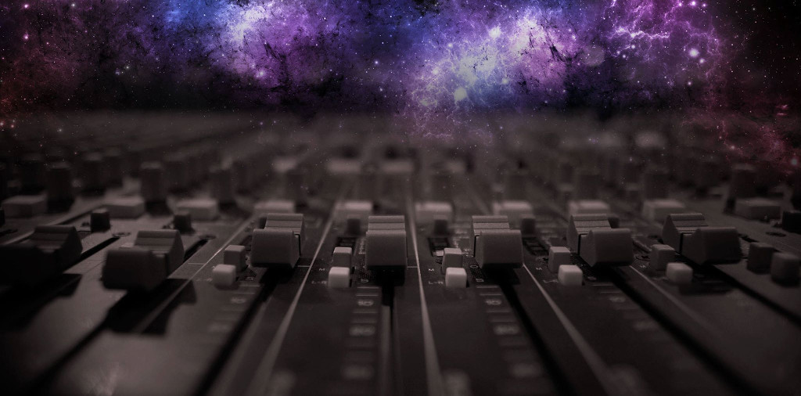
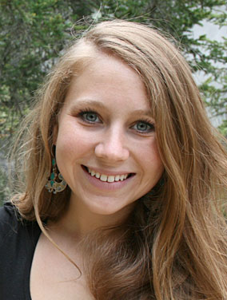
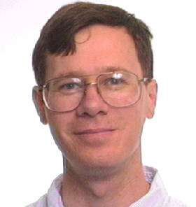
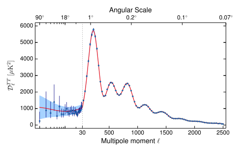

<head>

</head>

#Is our best description of the cosmos, the $$\Lambda$$CDM model, right?
Feb 16, 2016 - [Marius Millea](http://www.cosmologyathome.org/view_profile.php?userid=990172)
{: .date}

Today we are excited to officially release a new app at Cosmology@Home (called `planck_param_sims`), allowing anyone to contribute to current analysis of data from the [Planck](https://en.wikipedia.org/wiki/Planck_(spacecraft)) satellite and to better understand our cosmos! The one sentence summary of this app is that its sort of like turning your computer into a mixer board and playing DJ with the echoes of the Big Bang! So what exactly does that mean, and how do these results contribute to science? Find out in this post, with some help from our main collaborators on this project. 

If you are reading this and are not a member of Cosmology@Home but would like to join, you can do so [here](join.php).

{: .figure}

Perhaps the most sought after goal in modern cosmology, at least in the short term, is to break the $$\Lambda$$-cold-dark-matter model (or $$\Lambda$$CDM for short). By this we mean, to find a piece of data which $$\Lambda$$CDM fails to explain.

{: .profile}

> The $$\Lambda$$CDM model is our current best and simplest description of how the universe evolves in time and space. It uses Einstein's general relativity to describe gravity and the so called "Standard Model" to describe how particles interact amongst themselves. In order to properly describe observations, it postulates that the universe began with a period of exponential expansion called "inflation", and is composed of: "baryonic matter", the well-known ordinary matter we experience everyday around us, whose microscopic properties are well known and studied; "radiation", i.e. photons and neutrinos, well known and observed particles that travel as fast (or almost) as the speed of light; "Cold Dark Matter" (CDM), a yet-to-be understood type of matter whose  gravitational effects are observed in our universe, but whose microscopic properties are still unknown; "Dark Energy" ($$\Lambda$$), a not-yet-well understood form of energy that is responsible for the accelerated expansion of the universe observed today. There are many things that we still don't understand about this model, however. For example, think about the fact that we've never directly seen or detected either of the two key players (from which the model draws its name, $$\Lambda$$ and CDM) that together make up 95% of the energy content of the universe. Their nature is still a complete mystery!  -Silvia Galli

So why are scientists trying find failures of this explanation, this $$\Lambda$$CDM model, which we ourselves thought up? The answer is that we know that at some level it is an approximation, and finding the failures points us in the direction of finding the deeper more fundamental explanation. This could mean hints as to the nature of dark matter, dark energy, or even of the "inflationary" phase early in the history of the universe.  

To-date the best piece of data we have for testing the $$\Lambda$$CDM model are observations of the Cosmic Microwave Background (or CMB, for short). The CMB is the microwave radiation emitted by the hot plasma which was present shortly after the Big Bang, and which has been permeating and traveling throughout the universe ever since. In some sense, it is the echo of the Big Bang. 

{: .profile}

> The CMB is the most direct way we have of measuring the very early universe. It's broad features are a direct image of the quantum fluctuations that seeded all observable structure in the universe and therefore allows us to probe the mechanisms that created the universe and the structure in it at the origin of time. The detailed features tell us about the composition of the universe, including the fraction of dark matter and ordinary matter. Since the microwave light has been traveling through 13.8 billion years of cosmic expansion it tells us about the overall geometry of the universe and contains important clues about the recent accelerated expansion, thought to be driven by dark energy. -[Ben Wandelt](http://ilp.upmc.fr/wandelt.php)

Here is an animation of what the CMB looks like on the sky. The red spots represent regions where the radiation is hotter and the blue spots where the radiation is colder. These patterns encode a wealth of information about the universe.

The best current measurements of the CMB come from a satellite launched in 2009 called Planck. (By the way, all of us mentioned in this post are part of the collaboration which designed, launched, and is currently analyzing the data from this satellite).

{: .profile}

> [Planck](http://www.esa.int/Planck) is a satellite expressly designed to study the minute fluctuations in the temperature of the CMB across the whole sky, the third such mission ever performed (following [COBE](https://en.wikipedia.org/wiki/Cosmic_Background_Explorer) and [WMAP](https://en.wikipedia.org/wiki/Wilkinson_Microwave_Anisotropy_Probe)). It is a project of the European Space Agency (ESA) with instruments provided by two scientific consortia funded by ESA member states and led by Principal Investigators from France and Italy, telescope reflectors provided through a collaboration between ESA and a scientific consortium led and funded by Denmark, and additional contributions from NASA (USA). Named in honor of the German Nobel laureate Max Planck (1858-1947), the satellite employs 74 detectors cooled to near absolute zero, to measure the fluctuations of the CMB with an accuracy set by fundamental astrophysical limits. -[Martin White](http://w.astro.berkeley.edu/~mwhite/)

To analyze the pattern of hot and cold spots in the CMB measured by Planck, we transform this data down to the so called "power spectrum", pictured below.

{: .figure}

The power spectrum tells us how much structure there is on the map at a given scale. Its similar to the equalizer on your stereo; if the bars on the left of the equalizer are large, your music has a lot of bass (i.e. a lot of structure at low frequencies), where-as if the bars on the right are large, your music has a lot of treble (high frequencies). Similarly here, the data points on the left represent the low frequency large scales, and the data points on the right indicate the high frequency small scales (actually, some of our collaborators have taken the music analogy to its full conclusion and made [web applet](http://web.physics.ucsb.edu/~jatila/CMB-sounds/CMB) which lets you listen to listen to the CMB as if it were a sound).

If you fiddle with the bass and treble knobs on your stereo, you can distort how your music sounds, but probably you will still be able to recognize the song. The key test which we are performing with this new `planck_param_sims` app, is to fiddle with the analogous "bass and treble knobs" on the Planck data, picking combinations that keep only particular scales. Then we ask, *does this still sound like the $$\Lambda$$CDM model?* Our system is a little more sophisticated than a car stereo. We're able to filter the music in many different ways. Its as if we've got a giant mixing board and we're playing with different configurations of the sliders, filtering the music to keep only certain regions of the spectrum. There are about 100 different configurations we look at. Our criteria for "still sounds like $$\Lambda$$CDM" is a little more sophisticated too. We can use the values of the parameters of the model.

{: .profile}

> We take our $$\Lambda$$CDM parameters to be the spatially-averaged baryon density (the mass density of ordinary atomic matter), the spatially-averaged total matter density (including dark matter), the value of the cosmological constant, the amplitude of the primordial density fluctuations on one particular length scale, one parameter (the "tilt") that describes how that amplitude depends on length scale, and the probability that a CMB photon had its last scattering event, not in the early universe, but in the reionized intergalactic medium. These are all the parameters we need to calculate the power spectra predicted by the $$\Lambda$$CDM model. If the $$\Lambda$$CDM model is correct, then its parameters inferred from one particular region of the data should be consistent with parameters inferred from another. If there are additional degrees of freedom in the universe, beyond those in the $$\Lambda$$CDM model, then we might expect different regions to lead to different values of the $$\Lambda$$CDM parameters. -[Lloyd Knox](http://www.lloydknox.com/)

So are different regions of the data supposed to give the exact same values of parameters to any number of decimal places? No. There are many reasons that we expect some differences, for example random measurement noise from the Planck detectors. The jobs we run on your computers run simulations to help us figure out *exactly* the level of expected differences we should see. Then we compare this to the differences we see in the actual data. If the differences are similar, then $$\Lambda$$CDM passes another precision test and we are in awe of how well this simple model works. If however we don't see consistency, then we are extremely excited because it means we've found something interesting! The most interesting possibility of course is that we are seeing hints of this model breaking down, which could point to a new and better understanding of our universe. 

We don't really know what result we'll get. A calculation of these expected differences has never been done to this scale nor to this accuracy. Part of the reason is that its a computationally expensive task. Analyzing the Planck data just once is not trivial, and doing so for ~100 different configurations of filters, and simulating *that* process thousands of times, is much less so! That of course is where you as volunteers come in. With your help we will be able to map out this distribution of changes. The first phase of this calculation should take a few weeks to a couple of months. Depending on what we find, we may extend it in various ways. I'm looking forward to seeing what we find!

